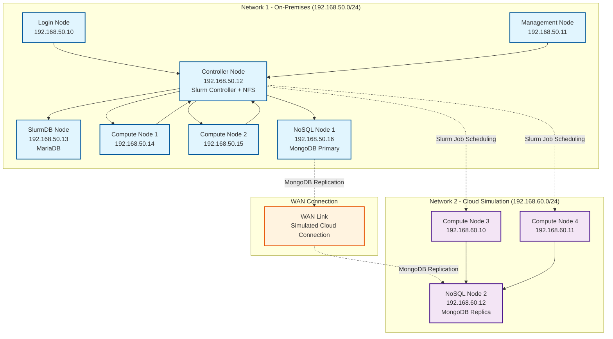

# Burst-A-Flat: Slurm Cluster with Cloud Burst Simulation

This project demonstrates a Slurm cluster setup that simulates a cloud burst scenario where traditional shared storage (NFS) fails, but a NoSQL database provides the solution for distributed data access.

## Why the Name "Burst-a-Flat"
You can't burst a flat tire so why this name for a project?

Let's start with the term "Flat".  By flat, I am referring to a flat data file.  This is a single file or a set of files that contain a significant amount of data for computation.

Now, "Burst".  "Cloud Bursting" is a buzz word that I dislike but I am using it here for a reason.  I think that some workloads might be able to survive and thrive in a hybrid cloud and cloud bursting architecture.  This project is meant to demonstrate examples of how this could be done.

The name is also meant to be fun! Besides a demo of a concept, this project is a fully functional slurm playground.  Other similar projects use containers to provide greater support for host OS and to run on the typical resources available to most machines.  This project is a bit selfish in that it requires Ubuntu and at least 24 GB of memory.  However I think the benefits are tremendous for anyone who wants to explore and kick the tires a bit.  Maybe install some additional packages if you wish.

Whether we are data scientists or HPC engineers we likely share some paradoxical wishes:
1. A single source of truth on our storage
2. Location-agnostic high-performance storage to be available at a single endpoint.
3. Continue to support the smorgasboard of statistical applications and computational strategies in our industries, regardless of what that industry may be.
4. Petabyte (or even exabyte) storage for limitlessly reckless duplication and deduplication of data.
5. A zero-effort solution

Every existing worlkload is different and might need an investment of time to make this transition.  There needs to be some collaboration and effort between the System Engineers behind the computational systems and the data scientists.  It is difficult work.

Burst-A-Flat aspires to provide an instructional example to start this path.  This project is intended to inspire; not just to fix a specific problem. This is a workshop and demonstration of a problem solved, but more importantly this is a mindset of writing new code for new projects on-premise, in the cloud, and hybrid computing environments so that our work is prepared to move to the next level.

In summary, this project provides a simulation of a workload built to scale from a few CPUs to gigantic proportions.  This is one of, I hope, an array of examples in which different types of computational workloads can be architected ready for true cloud bursting.


## Architecture

### Network 1 (On-Premises)
- **Login Node**: User access point
- **Management Node**: Cluster administration
- **Controller Node**: Slurm controller + NFS server
- **SlurmDB Node**: MariaDB for Slurm accounting
- **Compute Nodes**: 2 cluster compute nodes
- **NoSQL Node**: MongoDB primary instance

### Network 2 (Cloud Simulation)
- **Compute Nodes**: Additional compute capacity
- **NoSQL Node**: MongoDB replica for data synchronization

## Architecture Diagram



## Key Features

- **NFS Shared Storage**: All Network 1 nodes mount `/home` from controller
- **NoSQL Database**: MongoDB replication between networks for cloud burst scenarios
- **Slurm Job Scheduler**: Distributed job management across both networks
- **R Workload Demo**: Demonstrates failure with traditional storage and success with NoSQL

## Prerequisites

### Required Software
- **Vagrant** (latest version)
- **Ansible** (2.9+)

### Virtualization Provider
- **KVM/libvirt** (Linux, recommended for cloud burst simulation)
  - KVM support in kernel
  - libvirt daemon and tools
  - Vagrant libvirt plugin: `vagrant plugin install vagrant-libvirt`

## Quick Start

### Step 1: Setup KVM/libvirt
```bash
# Linux only
./setup.sh
```

### Step 2: Deploy Infrastructure
```bash
vagrant up
```

### Step 3: Configure Cluster
```bash
ansible-playbook -i inventory/hosts playbooks/site.yml
```

### Step 4: Test the Cluster
```bash
vagrant ssh login-node
sinfo
```

### Step 5: Run R Workload Demo
```bash
# This will demonstrate the cloud burst scenario
sbatch scripts/r_workload_demo.sh
```

## KVM/libvirt Benefits
This is one of the reasons this project has such narrow compatibility.  My apologies for this.  It might be possible to expand this to other hypervisor platforms but that will require more work and time.

This project uses KVM/libvirt for optimal cloud burst simulation:

### KVM/libvirt Advantages
- ✅ **Native Linux performance** with hardware virtualization
- ✅ **Advanced networking** with libvirt networks and bridges
- ✅ **Better resource management** and isolation
- ✅ **Cloud-native** - same technology used in production clouds
- ✅ **Free and open source**

### Networking Features
- **Two separate networks** (on-premises and cloud simulation)
- **NAT gateway** through controller node for internet access
- **Internal networking** for realistic cloud burst scenarios
- **Host-to-VM communication** for Ansible management

## Usage

### Submitting Jobs

```bash
# Login to the cluster
vagrant ssh login-node

# Check cluster status
sinfo

# Submit a job
sbatch my_job.sh

# Monitor jobs
squeue
```

### R Workload Demonstration

The included R workload demonstrates:
1. **Traditional Failure**: Attempts to read `.Rdata` files from NFS (fails on Network 2)
2. **Cloud Burst Success**: Uses MongoDB to access data across networks

## Step-by-Step Guide: Converting R Jobs to Use NoSQL Databases

This guide helps researchers migrate from traditional flat file storage to NoSQL databases for distributed computing scenarios.

### Overview: Why Use NoSQL for Research Computing?

**Traditional Approach (Problems):**
- ❌ **Shared file systems fail** in cloud burst scenarios
- ❌ **Data synchronization issues** across distributed nodes
- ❌ **Single point of failure** with NFS/storage servers
- ❌ **Limited scalability** for large datasets

**NoSQL Database Approach (Benefits):**
- ✅ **Distributed data access** across multiple nodes
- ✅ **Automatic replication** and failover
- ✅ **Horizontal scaling** for large datasets
- ✅ **Cloud-native** architecture

### Selection of a NoSQL Database

#### MongoDB (Recommended for R)
- **Best for**: Document-based data, JSON-like structures
- **R Integration**: Excellent with `mongolite` package
- **Use Cases**: Time series, experimental data, metadata

#### Alternative Options that I considered:
- **Redis**: Key-value store, great for caching
- **Cassandra**: Wide-column store, excellent for time series
- **CouchDB**: Document database with built-in replication

## Follow Along and Try It Yourself

### Step 1: Install Required R Packages

```r
# Install MongoDB connector for R
install.packages("mongolite")

# Install additional packages for data manipulation
install.packages(c("jsonlite", "dplyr", "lubridate"))

# Load libraries
library(mongolite)
library(jsonlite)
library(dplyr)
library(lubridate)
```

### Step 2: Convert Your Data Storage

#### Before: Traditional Flat Files
```r
# OLD APPROACH - Flat files
# Save data
save(my_data, file = "data/experiment_001.Rdata")

# Load data
load("data/experiment_001.Rdata")
```

#### After: NoSQL Database
```r
# NEW APPROACH - MongoDB
# Connect to database
con <- mongo(collection = "experiments", db = "research_db", 
             url = "mongodb://mongodb-cluster:27017")

# Save data to database
con$insert(my_data)

# Load data from database
my_data <- con$find('{"experiment_id": "001"}')
```

### Step 3: Modify Your R Scripts

#### Example 1: Basic Data Storage Migration

**Original Script:**
```r
# Load experimental data
load("data/experiment_001.Rdata")

# Process data
results <- process_data(my_data)

# Save results
save(results, file = "results/experiment_001_results.Rdata")
```

**NoSQL Version:**
```r
# Connect to MongoDB
con <- mongo(collection = "experiments", db = "research_db", 
             url = "mongodb://mongodb-cluster:27017")

# Load experimental data from database
my_data <- con$find('{"experiment_id": "001"}')

# Process data
results <- process_data(my_data)

# Save results to database
results_con <- mongo(collection = "results", db = "research_db", 
                     url = "mongodb://mongodb-cluster:27017")
results_con$insert(results)
```

#### Example 2: Time Series Data

**Original Script:**
```r
# Load time series data
load("data/sensor_data.Rdata")

# Aggregate by hour
hourly_data <- sensor_data %>%
  group_by(hour = floor_date(timestamp, "hour")) %>%
  summarise(avg_value = mean(value))
```

**NoSQL Version:**
```r
# Connect to MongoDB
con <- mongo(collection = "sensor_data", db = "research_db", 
             url = "mongodb://mongodb-cluster:27017")

# Load time series data from database
sensor_data <- con$find('{"timestamp": {"$gte": "2024-01-01"}}')

# Convert to data frame if needed
sensor_data <- as.data.frame(sensor_data)

# Aggregate by hour
hourly_data <- sensor_data %>%
  group_by(hour = floor_date(as.POSIXct(timestamp), "hour")) %>%
  summarise(avg_value = mean(value))
```

### Step 4: Handle Distributed Computing

#### Slurm Job Script with NoSQL

**Original Job Script:**
```bash
#!/bin/bash
#SBATCH --job-name=analysis
#SBATCH --nodes=1
#SBATCH --ntasks=1

# Load R
module load R

# Run analysis
Rscript analysis.R
```

**NoSQL Job Script:**
```bash
#!/bin/bash
#SBATCH --job-name=analysis
#SBATCH --nodes=1
#SBATCH --ntasks=1

# Load R
module load R

# Set MongoDB connection (use environment variable)
export MONGODB_URL="mongodb://mongodb-cluster:27017"

# Run analysis
Rscript analysis_nosql.R
```

#### R Script with Environment Variables
```r
# Get MongoDB URL from environment (set by Slurm job script)
mongodb_url <- Sys.getenv("MONGODB_URL", "mongodb://mongodb-cluster:27017")

# Connect to database
con <- mongo(collection = "experiments", db = "research_db", 
             url = mongodb_url)

# Your analysis code here...
```

### Step 5: Data Migration Strategies

#### Strategy 1: Gradual Migration
```r
# Function to migrate existing Rdata files
migrate_rdata_to_mongodb <- function(file_path, collection_name) {
  # Load existing data
  load(file_path)
  
  # Connect to MongoDB
  con <- mongo(collection = collection_name, db = "research_db", 
               url = "mongodb://mongodb-cluster:27017")
  
  # Insert data
  con$insert(get(ls()[1]))  # Get the first object from the Rdata file
  
  cat("Migrated", file_path, "to MongoDB\n")
}

# Migrate multiple files
files <- list.files("data/", pattern = "*.Rdata", full.names = TRUE)
for (file in files) {
  migrate_rdata_to_mongodb(file, "experiments")
}
```

#### Strategy 2: Hybrid Approach

This is a bit sloppy, but perhaps less prone to be disruptive to individuals on a collaborative research project.

```r
# Check if data exists in MongoDB, fallback to file
load_data_smart <- function(experiment_id) {
  # Try MongoDB first
  con <- mongo(collection = "experiments", db = "research_db", 
               url = "mongodb://mongodb-cluster:27017")
  
  data <- con$find(paste0('{"experiment_id": "', experiment_id, '"}'))
  
  if (nrow(data) > 0) {
    cat("Loaded from MongoDB\n")
    return(data)
  } else {
    # Fallback to file
    cat("Loading from file, migrating to MongoDB\n")
    load(paste0("data/experiment_", experiment_id, ".Rdata"))
    con$insert(get(ls()[1]))
    return(get(ls()[1]))
  }
}
```

### Step 6: Best Practices for Research Computing

#### 1. Data Organization
```r
# Structure your data with metadata
experiment_data <- list(
  experiment_id = "exp_001",
  timestamp = Sys.time(),
  researcher = "Dr. Smith",
  parameters = list(
    temperature = 25,
    pressure = 1013,
    duration = 3600
  ),
  data = my_actual_data
)

# Insert with metadata
con$insert(experiment_data)
```

#### 2. Query Optimization
```r
# Use indexes for better performance
con$index(add = '{"experiment_id": 1}')
con$index(add = '{"timestamp": 1}')

# Query with filters
recent_experiments <- con$find('{"timestamp": {"$gte": "2024-01-01"}}')
```

#### 3. Error Handling
```r
# Robust connection handling
connect_to_mongodb <- function() {
  tryCatch({
    con <- mongo(collection = "experiments", db = "research_db", 
                 url = "mongodb://mongodb-cluster:27017")
    return(con)
  }, error = function(e) {
    cat("MongoDB connection failed:", e$message, "\n")
    cat("Falling back to file system\n")
    return(NULL)
  })
}
```

### Step 7: Performance Optimization

#### Connection Pooling
```r
# Reuse connections in long-running jobs
con <- mongo(collection = "experiments", db = "research_db", 
             url = "mongodb://mongodb-cluster:27017")

# Use the same connection for multiple operations
for (i in 1:1000) {
  data <- con$find(paste0('{"batch": ', i, '}'))
  # Process data...
}
```

#### Batch Operations
```r
# Insert multiple documents at once
batch_data <- lapply(1:1000, function(i) {
  list(experiment_id = paste0("exp_", i), data = generate_data())
})

con$insert(batch_data)
```

### Step 9: Monitoring and Debugging

#### Check Database Status
```r
# Verify connection
con$count()

# Check collections
con$run('{"listCollections": 1}')

# Monitor performance
con$run('{"serverStatus": 1}')
```

#### Logging
```r
# Add logging to your R scripts
log_analysis <- function(experiment_id, status) {
  log_entry <- list(
    timestamp = Sys.time(),
    experiment_id = experiment_id,
    status = status,
    node = Sys.info()["nodename"]
  )
  
  log_con <- mongo(collection = "analysis_logs", db = "research_db", 
                   url = "mongodb://mongodb-cluster:27017")
  log_con$insert(log_entry)
}
```

### Step 10: Complete Example

Here's a complete example of converting a research analysis:

**Original Analysis Script:**
```r
# Load data
load("data/experiment_001.Rdata")

# Process data
results <- my_data %>%
  filter(condition == "treatment") %>%
  group_by(time_point) %>%
  summarise(mean_value = mean(value))

# Save results
save(results, file = "results/experiment_001_results.Rdata")
```

**NoSQL Version:**
```r
library(mongolite)
library(dplyr)

# Connect to MongoDB
con <- mongo(collection = "experiments", db = "research_db", 
             url = "mongodb://mongodb-cluster:27017")

# Load data from database
my_data <- con$find('{"experiment_id": "001"}')

# Process data
results <- my_data %>%
  filter(condition == "treatment") %>%
  group_by(time_point) %>%
  summarise(mean_value = mean(value))

# Save results to database
results_con <- mongo(collection = "results", db = "research_db", 
                     url = "mongodb://mongodb-cluster:27017")
results_con$insert(results)

# Log completion
log_analysis("001", "completed")
```

### Troubleshooting Common Issues

#### Connection Issues
```r
# Test MongoDB connectivity
test_mongodb_connection <- function() {
  tryCatch({
    con <- mongo(collection = "test", db = "test", 
                 url = "mongodb://mongodb-cluster:27017")
    con$insert(list(test = "connection"))
    con$drop()
    return(TRUE)
  }, error = function(e) {
    cat("MongoDB connection failed:", e$message, "\n")
    return(FALSE)
  })
}
```

#### Data Type Issues
```r
# Ensure proper data types
prepare_data_for_mongodb <- function(data) {
  # Convert factors to characters
  data[] <- lapply(data, function(x) {
    if (is.factor(x)) as.character(x) else x
  })
  
  # Convert dates to strings
  data[] <- lapply(data, function(x) {
    if (inherits(x, "Date") || inherits(x, "POSIXt")) {
      as.character(x)
    } else x
  })
  
  return(data)
}
```

This guide provides a complete pathway for researchers to migrate from traditional file-based storage to NoSQL databases, enabling distributed computing and cloud burst scenarios.

## File Structure

```
├── README.md
├── Vagrantfile
├── inventory/
│   └── hosts
├── playbooks/
│   ├── site.yml
│   ├── slurm-controller.yml
│   ├── slurm-compute.yml
│   ├── nfs-server.yml
│   ├── mariadb.yml
│   └── mongodb.yml
├── scripts/
│   ├── r_workload_demo.sh
│   └── generate_test_data.R
└── data/
    └── sample_data.Rdata
```

## Troubleshooting

### Installation and Setup

#### KVM/libvirt Setup Issues

If you encounter errors like "The provider 'libvirt' that was requested to back the machine is reporting that it isn't usable on this system", this indicates a KVM/libvirt setup issue.

**Solution**: Ensure KVM/libvirt is properly configured:

1. **Check KVM support**:
   ```bash
   lsmod | grep kvm
   ```
2. **Check libvirt status**:
   ```bash
   sudo systemctl status libvirtd
   ```
3. **Verify user groups**:
   ```bash
   groups $USER
   # Should include 'libvirt' and 'kvm'
   ```
4. **Install missing packages**:
   ```bash
   sudo apt install qemu-kvm libvirt-daemon-system libvirt-clients bridge-utils virt-manager
   ```
5. **Add user to groups**:
   ```bash
   sudo usermod -a -G libvirt $USER
   sudo usermod -a -G kvm $USER
   ```
6. **Log out and back in** (or reboot) for group changes to take effect
7. **Install vagrant-libvirt plugin**:
   ```bash
   vagrant plugin install vagrant-libvirt
   ```

**Why this happens**: KVM/libvirt requires proper kernel modules, user permissions, and service configuration. The setup script handles most of this automatically.

### Common Issues

1. **NFS Mount Failures**: Check controller node NFS service
2. **Slurm Communication**: Verify Munge keys are synchronized
3. **MongoDB Replication**: Check network connectivity between nodes


### Logs

- Slurm logs: `/var/log/slurm/`
- NFS logs: `/var/log/nfs/`
- MongoDB logs: `/var/log/mongodb/`

## Contributing

1. Fork the repository
2. Create a feature branch
3. Make your changes
4. Test with `vagrant up` and `ansible-playbook`
5. Submit a pull request

## License

MIT License - see LICENSE file for details.