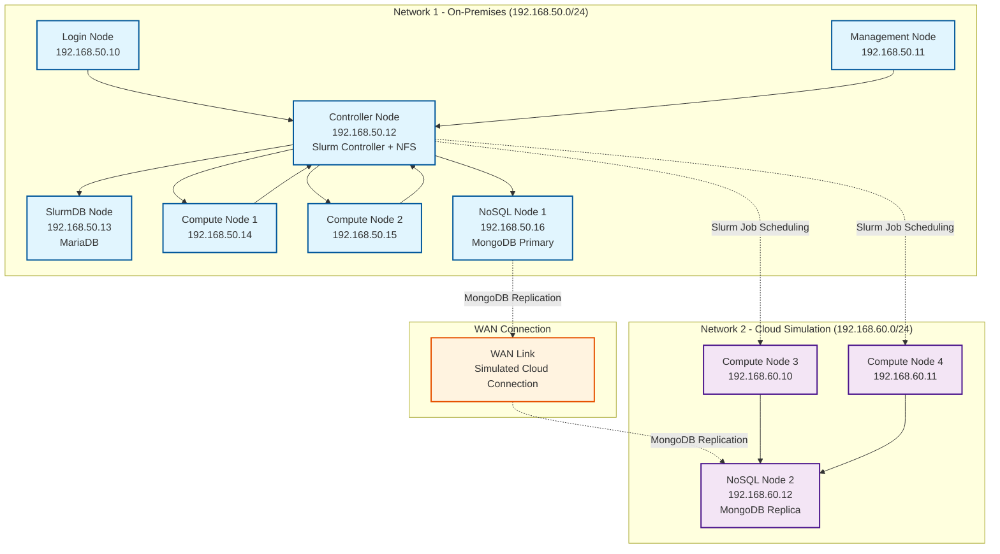

# Burst-A-Flat: Slurm Cluster with Cloud Burst Simulation

This project demonstrates a Slurm cluster setup that simulates a cloud burst scenario where traditional shared storage (NFS) fails, but a NoSQL database provides the solution for distributed data access.

## Architecture

### Network 1 (On-Premises)
- **Login Node**: User access point
- **Management Node**: Cluster administration
- **Controller Node**: Slurm controller + NFS server
- **SlurmDB Node**: MariaDB for Slurm accounting
- **Compute Nodes**: 2 cluster compute nodes
- **NoSQL Node**: MongoDB primary instance

### Network 2 (Cloud Simulation)
- **Compute Nodes**: Additional compute capacity
- **NoSQL Node**: MongoDB replica for data synchronization

## Architecture Diagram



## Key Features

- **NFS Shared Storage**: All Network 1 nodes mount `/home` from controller
- **NoSQL Database**: MongoDB replication between networks for cloud burst scenarios
- **Slurm Job Scheduler**: Distributed job management across both networks
- **R Workload Demo**: Demonstrates failure with traditional storage and success with NoSQL

## Prerequisites

### Required Software
- **Vagrant** (latest version)
- **Ansible** (2.9+)

### Virtualization Provider (Choose One)
- **VirtualBox** (free, recommended for beginners)
  - VirtualBox 6.0+
  - VirtualBox Extension Pack (recommended)
- **vSphere** (enterprise, better performance)
  - vSphere 6.5+
  - Vagrant vSphere plugin: `vagrant plugin install vagrant-vsphere`

## Quick Start

### Step 1: Choose Your Provider
```bash
# Linux/Mac
./setup.sh

# Windows
setup.bat
```

### Step 2: Deploy Infrastructure
```bash
vagrant up
```

### Step 3: Configure Cluster
```bash
ansible-playbook -i inventory/hosts playbooks/site.yml
```

### Step 4: Test the Cluster
```bash
vagrant ssh login-node
sinfo
```

### Step 5: Run R Workload Demo
```bash
# This will demonstrate the cloud burst scenario
sbatch scripts/r_workload_demo.sh
```

## Provider Flexibility

This project supports both VirtualBox and vSphere, allowing you to choose based on your needs:

### VirtualBox (Recommended for Beginners)
- ✅ **Free** and open source
- ✅ Easy to install and configure
- ✅ Good for learning and development
- ⚠️ Lower performance than VMware
- ⚠️ May have issues with WSL on Windows

### vSphere (Recommended for Production)
- ✅ **Better performance** and stability
- ✅ Better Windows/WSL compatibility
- ✅ More advanced networking features
- ❌ Requires paid license
- ❌ More complex setup

### Switching Providers
You can easily switch between providers:

```bash
# Switch to VirtualBox
bash scripts/generate_vagrantfile.sh virtualbox

# Switch to vSphere
bash scripts/generate_vagrantfile.sh vsphere

# Or use the setup script
./setup.sh  # Linux/Mac
setup.bat   # Windows
```

## Usage

### Submitting Jobs

```bash
# Login to the cluster
vagrant ssh login-node

# Check cluster status
sinfo

# Submit a job
sbatch my_job.sh

# Monitor jobs
squeue
```

### R Workload Demonstration

The included R workload demonstrates:
1. **Traditional Failure**: Attempts to read `.Rdata` files from NFS (fails on Network 2)
2. **Cloud Burst Success**: Uses MongoDB to access data across networks

## File Structure

```
├── README.md
├── Vagrantfile
├── inventory/
│   └── hosts
├── playbooks/
│   ├── site.yml
│   ├── slurm-controller.yml
│   ├── slurm-compute.yml
│   ├── nfs-server.yml
│   ├── mariadb.yml
│   └── mongodb.yml
├── scripts/
│   ├── r_workload_demo.sh
│   └── generate_test_data.R
└── data/
    └── sample_data.Rdata
```

## Troubleshooting

### Installation and Setup

#### Vagrant Version Compatibility Issues

If you encounter errors like "The provider 'virtualbox' that was requested to back the machine is reporting that it isn't usable on this system" or see messages about unsupported VirtualBox versions, this indicates a version compatibility issue between Vagrant and VirtualBox.

**Solution**: Install the latest version of Vagrant from the official HashiCorp website:

1. **Visit the official download page**: https://www.vagrantup.com/downloads
2. **Download the latest version** for your operating system
3. **Install according to your OS**:
   - **Linux**: Download the `.deb` or `.rpm` package and install with your package manager
   - **macOS**: Download the `.dmg` file and follow the installation wizard
   - **Windows**: Download the `.msi` installer and run as administrator
4. **Verify the installation**:
   ```bash
   vagrant --version
   ```
5. **Clean up any existing Vagrant state**:
   ```bash
   vagrant destroy -f
   rm -rf .vagrant/
   ```
6. **Regenerate your Vagrantfile**:
   ```bash
   ./setup.sh  # Choose your preferred provider
   ```
7. **Deploy again**:
   ```bash
   vagrant up
   ```

**Why this happens**: Older versions of Vagrant may not support newer versions of VirtualBox. For example, Vagrant 2.3.4 only supports VirtualBox versions up to 7.0, but if you have VirtualBox 7.2.2 installed, you'll get compatibility errors.

**Alternative**: If you can't update Vagrant, you can use vSphere instead, which typically has better version compatibility.

### Common Issues

1. **NFS Mount Failures**: Check controller node NFS service
2. **Slurm Communication**: Verify Munge keys are synchronized
3. **MongoDB Replication**: Check network connectivity between nodes


### Logs

- Slurm logs: `/var/log/slurm/`
- NFS logs: `/var/log/nfs/`
- MongoDB logs: `/var/log/mongodb/`

## Contributing

1. Fork the repository
2. Create a feature branch
3. Make your changes
4. Test with `vagrant up` and `ansible-playbook`
5. Submit a pull request

## License

MIT License - see LICENSE file for details.