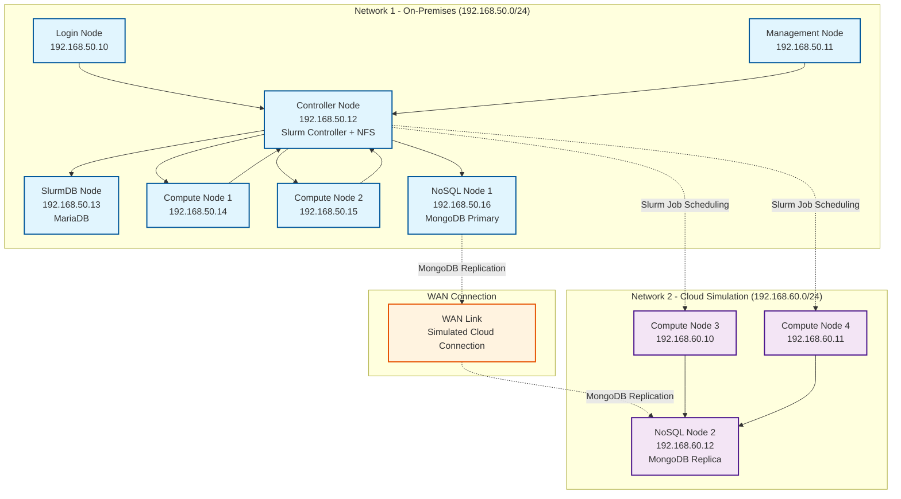

# Burst-A-Flat: Slurm Cluster with Cloud Burst Simulation

This project demonstrates a Slurm cluster setup that simulates a cloud burst scenario where traditional shared storage (NFS) fails, but a NoSQL database provides the solution for distributed data access.

## Architecture

### Network 1 (On-Premises)
- **Login Node**: User access point
- **Management Node**: Cluster administration
- **Controller Node**: Slurm controller + NFS server
- **SlurmDB Node**: MariaDB for Slurm accounting
- **Compute Nodes**: 2 cluster compute nodes
- **NoSQL Node**: MongoDB primary instance

### Network 2 (Cloud Simulation)
- **Compute Nodes**: Additional compute capacity
- **NoSQL Node**: MongoDB replica for data synchronization

## Architecture Diagram



## Key Features

- **NFS Shared Storage**: All Network 1 nodes mount `/home` from controller
- **NoSQL Database**: MongoDB replication between networks for cloud burst scenarios
- **Slurm Job Scheduler**: Distributed job management across both networks
- **R Workload Demo**: Demonstrates failure with traditional storage and success with NoSQL

## Prerequisites

### Required Software
- **Vagrant** (latest version)
- **Ansible** (2.9+)

### Virtualization Provider
- **KVM/libvirt** (Linux, recommended for cloud burst simulation)
  - KVM support in kernel
  - libvirt daemon and tools
  - Vagrant libvirt plugin: `vagrant plugin install vagrant-libvirt`

## Quick Start

### Step 1: Setup KVM/libvirt
```bash
# Linux only
./setup.sh
```

### Step 2: Deploy Infrastructure
```bash
vagrant up
```

### Step 3: Configure Cluster
```bash
ansible-playbook -i inventory/hosts playbooks/site.yml
```

### Step 4: Test the Cluster
```bash
vagrant ssh login-node
sinfo
```

### Step 5: Run R Workload Demo
```bash
# This will demonstrate the cloud burst scenario
sbatch scripts/r_workload_demo.sh
```

## KVM/libvirt Benefits

This project uses KVM/libvirt for optimal cloud burst simulation:

### KVM/libvirt Advantages
- ✅ **Native Linux performance** with hardware virtualization
- ✅ **Advanced networking** with libvirt networks and bridges
- ✅ **Better resource management** and isolation
- ✅ **Cloud-native** - same technology used in production clouds
- ✅ **Free and open source**

### Networking Features
- **Two separate networks** (on-premises and cloud simulation)
- **NAT gateway** through controller node for internet access
- **Internal networking** for realistic cloud burst scenarios
- **Host-to-VM communication** for Ansible management

## Usage

### Submitting Jobs

```bash
# Login to the cluster
vagrant ssh login-node

# Check cluster status
sinfo

# Submit a job
sbatch my_job.sh

# Monitor jobs
squeue
```

### R Workload Demonstration

The included R workload demonstrates:
1. **Traditional Failure**: Attempts to read `.Rdata` files from NFS (fails on Network 2)
2. **Cloud Burst Success**: Uses MongoDB to access data across networks

## File Structure

```
├── README.md
├── Vagrantfile
├── inventory/
│   └── hosts
├── playbooks/
│   ├── site.yml
│   ├── slurm-controller.yml
│   ├── slurm-compute.yml
│   ├── nfs-server.yml
│   ├── mariadb.yml
│   └── mongodb.yml
├── scripts/
│   ├── r_workload_demo.sh
│   └── generate_test_data.R
└── data/
    └── sample_data.Rdata
```

## Troubleshooting

### Installation and Setup

#### KVM/libvirt Setup Issues

If you encounter errors like "The provider 'libvirt' that was requested to back the machine is reporting that it isn't usable on this system", this indicates a KVM/libvirt setup issue.

**Solution**: Ensure KVM/libvirt is properly configured:

1. **Check KVM support**:
   ```bash
   lsmod | grep kvm
   ```
2. **Check libvirt status**:
   ```bash
   sudo systemctl status libvirtd
   ```
3. **Verify user groups**:
   ```bash
   groups $USER
   # Should include 'libvirt' and 'kvm'
   ```
4. **Install missing packages**:
   ```bash
   sudo apt install qemu-kvm libvirt-daemon-system libvirt-clients bridge-utils virt-manager
   ```
5. **Add user to groups**:
   ```bash
   sudo usermod -a -G libvirt $USER
   sudo usermod -a -G kvm $USER
   ```
6. **Log out and back in** (or reboot) for group changes to take effect
7. **Install vagrant-libvirt plugin**:
   ```bash
   vagrant plugin install vagrant-libvirt
   ```

**Why this happens**: KVM/libvirt requires proper kernel modules, user permissions, and service configuration. The setup script handles most of this automatically.

### Common Issues

1. **NFS Mount Failures**: Check controller node NFS service
2. **Slurm Communication**: Verify Munge keys are synchronized
3. **MongoDB Replication**: Check network connectivity between nodes


### Logs

- Slurm logs: `/var/log/slurm/`
- NFS logs: `/var/log/nfs/`
- MongoDB logs: `/var/log/mongodb/`

## Contributing

1. Fork the repository
2. Create a feature branch
3. Make your changes
4. Test with `vagrant up` and `ansible-playbook`
5. Submit a pull request

## License

MIT License - see LICENSE file for details.